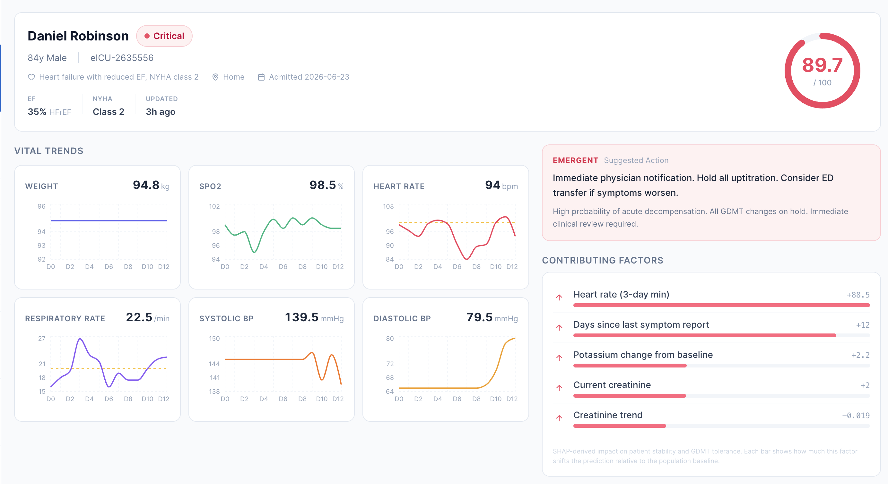
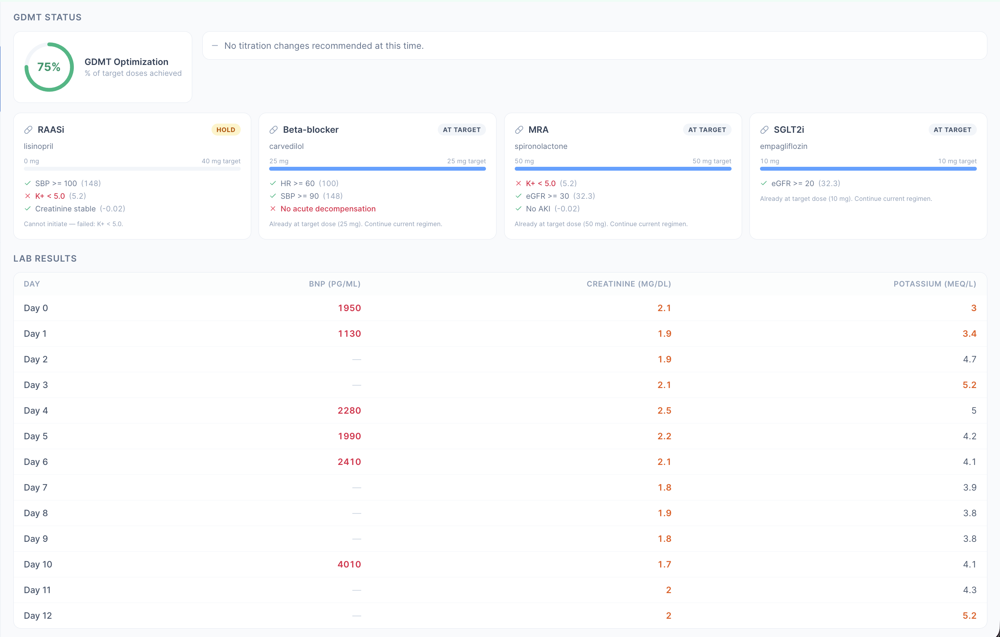
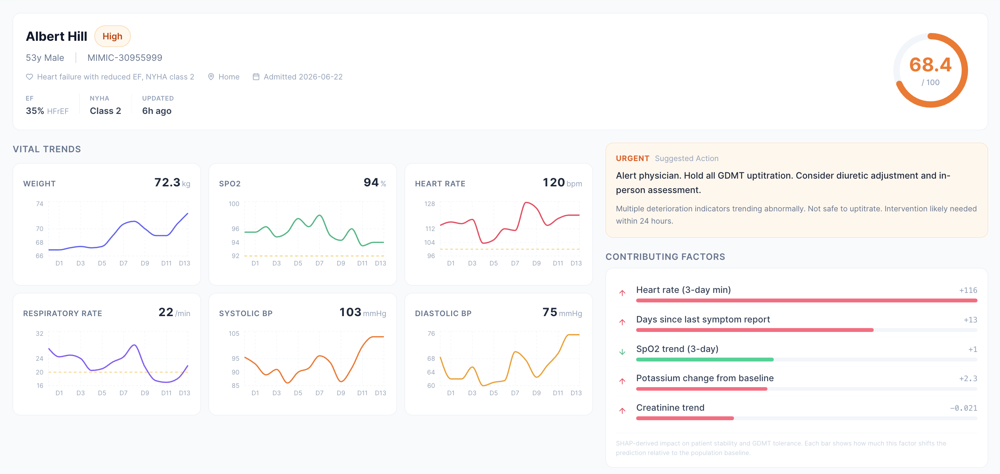

# HF Titration Assistant

[](https://github.com/cl-poehl/hf-titration-assistant/actions/workflows/ci.yml)
[](LICENSE)


**An explainable machine-learning prototype for deterioration-risk scoring in
heart-failure patients under hospital-at-home care.**

HF Titration Assistant is a research prototype exploring whether the temporal trajectory of
a heart-failure patient's vitals, labs, and symptoms can be used to flag
short-term clinical deterioration earlier and more selectively than fixed
thresholds — while keeping every prediction explainable (SHAP factor
attributions) and a clinician in the loop. It comprises a Python/FastAPI
prediction service and a React/TypeScript dashboard.

> [!IMPORTANT]
> **Research prototype — not a medical device.** It is trained and demonstrated
> on **synthetic** data and small **open-access demo** subsets, has not undergone
> prospective or external clinical validation, and must not be used for patient
> care or clinical decision-making. See [Scope and limitations](#scope-and-limitations).



*Patient detail: live risk score, vital-sign trends, suggested clinical action, and per-prediction SHAP factor attributions. All data shown is synthetic / open-access demo data.*

## Abstract

Threshold-based remote monitoring in hospital-at-home heart-failure programs
tends to alert either too late or too often. This prototype trains gradient-boosted
tree models (XGBoost, LightGBM) on 98 features engineered from the sliding-window
trajectory of a patient's vitals, labs, and patient-reported symptoms to score the
risk of deterioration requiring escalation. Scores are stratified into four risk
tiers (uncalibrated operating bands), each accompanied by SHAP-based factor
attributions and a suggested clinical action.

The contribution here is the **system and its methodology**, not a validated model:
a reproducible, file-based feature → train → serve pipeline, a rule-based GDMT
titration engine grounded in the ACC/AHA guideline, and a clinician-facing
dashboard. Because no open dataset exists for the target hospital-at-home setting,
quantitative evaluation is limited to a **synthetic signal-recovery check** — on a
2,000-patient generated cohort with strict patient-level splits the pipeline
recovers its designed signal at AUROC 0.80. That demonstrates the machinery is
wired correctly; it is **not** evidence the model predicts real deterioration. What
a defensible real-data validation would require is specified in
[`VALIDATION.md`](VALIDATION.md).

## Background

Heart failure is a leading cause of 30-day hospital readmissions, and a growing
number of hospital-at-home (HaH) programs manage acutely ill patients outside the
hospital. Monitoring in these programs is often threshold-based on raw vitals.
The hypothesis here is that modeling a patient's temporal trajectory — with
transparent, per-prediction reasoning — can improve the timeliness and selectivity
of escalation alerts. Short-horizon HF deterioration/readmission is a hard target:
gradient-boosted trees are the dominant tabular approach but reported discrimination
is modest and heterogeneous (best-model AUROC typically ≈ 0.73–0.81), and the
remote-monitoring trial evidence is mixed (TIM-HF2 positive, BEAT-HF null). A fuller
**Related work** synthesis and the clinical/system rationale are in
[`DESIGN.md`](DESIGN.md).

## Data

- **Synthetic cohort (primary).** A generator (`src/data_generation/generate_hf_patients.py`,
  fixed seed 42) produces 2,000 HF patients over a 30-day window with correlated
  vitals, labs, symptoms, and titration events. This is the primary training and
  evaluation set.
- **Open-access clinical demo subsets (secondary).** The **MIMIC-IV** and **eICU**
  *demo* datasets from PhysioNet are used to exercise a real-data ETL path. These
  are small (~hundreds of stays), openly licensed (ODbL) subsets — not the full
  credentialed databases. The large raw archives (~300 MB) are **not** committed;
  fetch them with [`scripts/download_data.sh`](scripts/download_data.sh). Small
  **derived** parquet extracts (`data/mimic/`, `data/eicu/`, `data/combined/`) —
  the output of the ETL that the demo API serves — *are* bundled so the app runs
  out of the box; these remain covered by the ODbL terms.

## Methods

- **Feature engineering** (`src/features/build_features.py`) — 98 features from
  sliding windows: rolling vital-sign statistics and trends, weight velocity,
  shock index, baseline deviations, lab values, symptom burden, and missingness
  indicators. See [`DESIGN.md`](DESIGN.md#feature-engineering-rationale) for the
  clinical rationale behind each family.
- **Models** (`src/models/train.py`) — XGBoost and LightGBM, with class-imbalance
  weighting; the higher-AUROC model is selected and serialized.
- **Validation** — splits are made at the **patient level** so all temporal
  windows of a patient share a fold, preventing leakage of a patient's future
  windows into training. Reported metrics: AUROC (with a patient-level bootstrap
  95% CI), AUPRC, a calibration curve, and per-tier sensitivity / specificity /
  PPV (`models/results/`).

## Results

> [!WARNING]
> **This project reports no validated predictive performance, and the numbers
> below are not clinical accuracy.** No open dataset exists for the target
> hospital-at-home setting, so the model has never been evaluated on adequate real
> data. The two figures below are *methodology checks* — read them as such. The
> protocol for a real validation is in [`VALIDATION.md`](VALIDATION.md).

| Cohort | What the number actually measures | AUROC (95% CI) | AUPRC |
|---|---|---|---|
| Synthetic (2,000 patients) | **Signal-recovery check** — can the pipeline recover the deterioration signal the generator injects? Self-referential by construction. | 0.80 (0.78–0.83) | 0.59 |
| Open demo (MIMIC-IV + eICU) | **ETL smoke test** on ~70 real patients — far too small to estimate performance; the high value is small-sample overfitting. | 0.95–0.99 | 0.72–0.83 |

**Why the synthetic 0.80 is not evidence.** The generator injects a deterioration
signal into the same vitals/labs the features are built from, and the label is
derived from the same event — so the model is recovering a pattern put in by hand.
It lands at 0.80 rather than a trivial 1.0 only because that injected signal is
partial and noisy, not because it reflects real physiology. It confirms the
feature → train → serve loop is wired correctly; it says nothing about clinical
accuracy. (The 95% CI is from 1,000 patient-level bootstrap resamples.)

**Why the demo 0.95–0.99 is not evidence.** That test set is ~70 patients; the
figure is small-sample overfitting, included only to prove the real-data ETL runs
end to end. The bundled dashboard and `/health` endpoint serve this demo model by
design, so the reported number is the demo figure, not a benchmark.

**A real-data check has been run.** On the open Zigong HF cohort (2,008 real
patients), the same methodology reaches AUROC 0.65 (95% CI 0.58–0.71) for 6-month
readmission — **on par with the published benchmark on the identical cohort** (best
model AUC 0.634, *J. Clin. Med.* 2023), and honestly below the synthetic figure.
Readmission on this data tops out in the low-to-mid 0.60s regardless of method, so
the modest figure reflects the difficulty of the task, not the modelling. It
validates the modelling/evaluation methodology, **not** the trajectory model (that
data is cross-sectional). Full numbers, baseline, and caveats are in
[`VALIDATION.md`](VALIDATION.md#track-a--result-executed).
Validating the trajectory model itself remains the primary open item and needs
credentialed time-series data. Model artifacts are committed as pickles so the app
runs without a training step.
Calibration curves, per-tier metrics, SHAP summaries, and feature-importance tables
are in `models/results/` and `models/results_real/`.

## Scope and limitations

This is an early-stage prototype. Its limitations are material and stated plainly:

- **Synthetic training data, self-referential evaluation.** The primary model is
  trained on generated data whose correlations reflect design assumptions, not real
  physiology, and its label is derived from the same injected event the features
  see. The 0.80 AUROC is therefore a signal-recovery check, not clinical accuracy —
  see [Results](#results) and [`VALIDATION.md`](VALIDATION.md).
- **No prospective or external validation.** The model has never been evaluated
  on real, held-out clinical data at scale.
- **Tiny real-data cohort.** The MIMIC-IV/eICU demo subsets are far too small for
  meaningful performance estimation.
- **Scores are uncalibrated.** Models are trained with class-imbalance weighting,
  which inflates the raw output, and no post-hoc calibration (Platt/isotonic) is
  applied. The scores are therefore *relative* risk, and the four tiers are
  operating bands — not calibrated probability cutoffs. A calibration curve is
  plotted but calibration is not corrected; this would be required before any
  probabilistic interpretation.
- **Synthetic medication / GDMT state.** Per-patient medication regimens and the
  GDMT titration view are synthetic, included to demonstrate the interface and
  safety logic — not learned or ingested from records. The "tolerance" score shown
  is a deliberate simplification (the complement of deterioration risk), not a
  separately trained or validated model.
- **Not clinically validated or regulated.** No FDA/CE assessment; not for clinical use.
- **Aspirational components not implemented:** FHIR ingestion, real-time
  streaming, cloud/security infrastructure, and device integrations described in
  [`DESIGN.md`](DESIGN.md) as future work.

## Screenshots

| GDMT titration engine + labs | Second patient (High risk) |
|---|---|
|  |  |

The GDMT panel evaluates each guideline pillar (RAASi / beta-blocker / MRA / SGLT2i)
with per-class safety checks and a titration recommendation; the labs table shows
"—" for days a lab was not measured. *(Synthetic medication state — see
[Scope and limitations](#scope-and-limitations).)*

## Architecture

```
React + TypeScript dashboard  ──/api proxy──▶  FastAPI service  ──▶  XGBoost/LightGBM + SHAP
   (Vite, Tailwind, Recharts)                  (/health /patients /predict …)     parquet feature store
```

- **Backend** (`src/`) — feature engineering, model training, a prediction wrapper
  with a SHAP `TreeExplainer` (`api/predictor.py`), and a file-based patient
  registry. No database; all data is parquet on disk.
- **Frontend** (`dashboard/`) — React 19, TypeScript 5 (strict), Vite 7, Tailwind
  v4, Recharts 3, with a mock-data fallback when the API is offline.

A file-by-file map is in [`ARCHITECTURE.md`](ARCHITECTURE.md).

## Reproducibility

```bash
# Backend API (runs out of the box: bundled model + demo patients)
pip install -r requirements.txt
uvicorn src.api.main:app --reload --port 8000

# Frontend
cd dashboard && npm install && npm run dev      # http://localhost:5173
```

Reproduce the synthetic pipeline end-to-end (fixed seed 42):

```bash
python src/data_generation/generate_hf_patients.py   # → data/raw/
python src/features/build_features.py                # → data/processed/features.parquet
python src/models/train.py                           # → models/best_model.pkl
python scripts/test_api.py                            # end-to-end validation, no server
```

Reproduce the real-data path:

```bash
bash scripts/download_data.sh                        # fetch MIMIC-IV + eICU demo
python src/data_generation/extract_mimic.py
python src/data_generation/extract_eicu.py
python src/data_generation/combine_datasets.py
python src/features/build_features.py --combined
python src/models/train.py --real
```

Paths default to the project root; override the base directories with the
`HFTA_DATA_DIR` and `HFTA_MODEL_DIR` environment variables (e.g. for
an HPC scratch workspace). Note: `xgboost`, `lightgbm`, and `shap` are heavier
dependencies typically run on a GPU/HPC node.

## Data-use statement

The MIMIC-IV and eICU *demo* datasets are redistributed by PhysioNet under the
Open Database License (ODbL) and require no credentialing, but their terms still
apply — see the [MIMIC-IV demo](https://physionet.org/content/mimic-iv-demo/) and
[eICU demo](https://physionet.org/content/eicu-crd-demo/) project pages. The raw
archives are not committed here; the small derived extracts that are bundled
(see [Data](#data)) remain under the ODbL. No protected health information is
used; patient display names in the dashboard are derived from a SHA-256 hash of
a synthetic ID.

## Citing this work

If you reference this prototype, please cite it via the metadata in
[`CITATION.cff`](CITATION.cff) (GitHub renders a "Cite this repository" button).

## Selected references

A full, grouped bibliography with a verification note is in
[`DESIGN.md`](DESIGN.md#references). Key sources:

- Koehler F, et al. Telemedical interventional management in heart failure (**TIM-HF2**): a randomised controlled trial. *Lancet.* 2018;392(10152):1047–1057. doi:10.1016/S0140-6736(18)31880-4
- Ong MK, et al. Remote patient monitoring after HF discharge (**BEAT-HF**). *JAMA Intern Med.* 2016;176(3):310–318. doi:10.1001/jamainternmed.2015.7712
- Abraham WT, et al. Wireless pulmonary artery haemodynamic monitoring (**CHAMPION**). *Lancet.* 2011;377(9766):658–666. doi:10.1016/S0140-6736(11)60101-3
- Zhang Y, et al. Explainable ML for predicting 30-day readmission in acute HF. *iScience.* 2024;27(7):110281. doi:10.1016/j.isci.2024.110281
- Lundberg SM, Lee S-I. A unified approach to interpreting model predictions (**SHAP**). *NeurIPS.* 2017;30:4765–4774.
- Lundberg SM, et al. From local explanations to global understanding with explainable AI for trees (**TreeExplainer**). *Nat Mach Intell.* 2020;2(1):56–67. doi:10.1038/s42256-019-0138-9
- Heidenreich PA, et al. 2022 **AHA/ACC/HFSA** guideline for the management of heart failure. *Circulation.* 2022;145(18):e895–e1032. doi:10.1161/CIR.0000000000001063
- Johnson AEW, et al. **MIMIC-IV**, a freely accessible electronic health record dataset. *Sci Data.* 2023;10:1. doi:10.1038/s41597-022-01899-x
- Pollard TJ, et al. The **eICU** Collaborative Research Database. *Sci Data.* 2018;5:180178. doi:10.1038/sdata.2018.178

## License

Released under the MIT License — see [`LICENSE`](LICENSE). Redistributed demo
datasets carry their own (ODbL) terms; the MIT license covers this repository's
code, not third-party data.
